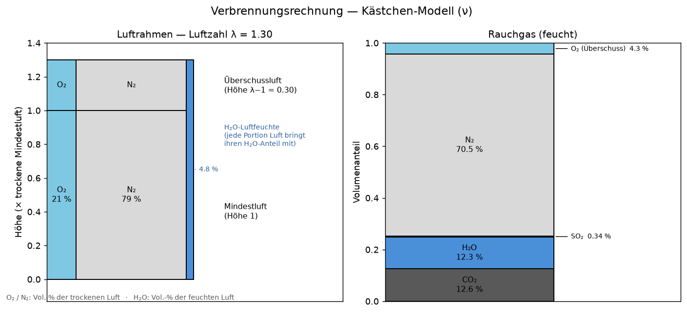

# Verbrennungsrechnung — das Kästchen-Modell (volumetrisch, ν)

Ein kleines, gut dokumentiertes Python-Werkzeug für die **Verbrennungsrechnung**
(Stoffbilanz) auf **molarer/volumetrischer Basis (ν)**. Es setzt ein anschauliches
Denkmodell aus meinem Studium (RWTH Aachen, *Energierohstoffe und -technik 2*) in
Code um: Luft und Rauchgas als **Kästchen**, verbunden über die Elementarreaktionen
der Verbrennung.



> 🌐 **Interaktive Web-Demo (ohne Installation, direkt im Browser):**
> **https://iknownothinglol.github.io/verbrennung/** — Regler ziehen, Kästchen und
> Werte-Tabelle rechnen live. (Lokal alternativ `python interaktiv.py`.)

> 📄 **Die konkrete Aufgabenstellung** (Brennstoffanalyse, Gegebene, Fragen) steht
> in **[`aufgabe.md`](aufgabe.md)** — das Beispiel, das dieses Werkzeug löst.

## Ziel & Transparenz zur KI-Nutzung

Dieses Projekt verfolgt **zwei Ziele**:

1. die **Modellierung eines Verbrennungsprozesses** (Stoffbilanz als Kästchen-Modell), und
2. die **Demonstration des Einsatzes von KI** als Werkzeug.

> **Transparenzhinweis:** Der gesamte Code dieses Projekts wurde von einer KI
> generiert — ich habe selbst nicht programmiert. Das fachliche Denkmodell, die
> Steuerung und die Validierung gegen die Übungsaufgabe stammen von mir.

## Die Idee

**Luftrahmen.** Die Verbrennungsluft wird als Rahmen gedacht, volumetrisch geteilt
in **O₂ (21 %)** und **N₂ (79 %)**. Die stöchiometrische *Mindestluft* hat die
Höhe 1; ein zweiter, gleicher Rahmen der Höhe **λ − 1** ist die *Überschussluft*.
Die Gesamthöhe ist die **Luftzahl λ**.

**Rauchgas.** Fünf gestapelte Kästchen: **CO₂ | H₂O | SO₂ | N₂ | O₂** (Überschuss).

**Verbindung** über die Reaktionen (je kmol):

```
C  + O₂      → CO₂
H₂ + ½ O₂    → H₂O
S  + O₂      → SO₂
N            → N₂   (unverändert ins Rauchgas)
```

Der im Brennstoff gebundene Sauerstoff senkt den O₂-Bedarf; **feuchte
Verbrennungsluft** bringt zusätzlich H₂O ins Rauchgas. Im Luftrahmen sitzt diese
Luftfeuchte als H₂O-Band **oben auf** der trockenen Luft — sie verändert die
O₂/N₂-Teilung und damit die **N₂-Menge nicht** (das N₂ folgt allein der trockenen
Luft). Alle Mengen sind molar, pro kg Brennstoff (kmol/kg\_BS).

## Was das Werkzeug kann

- **Vorwärtsrechnung:** Brennstoffanalyse (C/H/S/N/O/Asche/W) + λ (+ Luftfeuchte)
  → Luftmengen und Rauchgas (Mengen und volumetrische Zusammensetzung).
- **Interaktiv:** Schieberegler für λ, Zusammensetzung und Luftfeuchte;
  Kästchen **und eine Werte-Tabelle** (Luft- und Rauchgasmengen, Vol.-%)
  aktualisieren sich in Echtzeit.
- **Validiert:** gegen eine ERT2-Übungsaufgabe (siehe unten) mit Tests.

## Kern-Formeln (Kästchen-Modell, ν)

| Größe | Formel |
|---|---|
| stöch. O₂-Bedarf | v\_O₂,min = n\_C + ½·n\_H₂ + n\_S − n\_O(geb.) |
| trockene Luft (Höhe λ) | v\_L,tr = v\_O₂,min · λ / x\_O₂,L |
| Überschuss-O₂ | v\_O₂,ü = (λ − 1) · v\_O₂,min |
| Luft-N₂ | v\_N₂ = v\_L,tr · (1 − x\_O₂,L) |
| Luftfeuchte-H₂O | v\_H₂O,L = v\_L,tr · x\_H₂O,L / (1 − x\_H₂O,L) |
| Rauchgas gesamt | v\_G = v\_CO₂ + v\_H₂O + v\_SO₂ + v\_N₂ + v\_O₂ |

## Validierung: ERT2 Übung 3, Aufgabe 1

Kohle (M.-%): C 55 · H 4 · O 15 · N 2 · S 4 · Asche 5 · Wasser 15.
Gegeben: x\_O₂,L = 21 Vol.-%, x\_H₂O,L = 4,82 Vol.-% (feuchte Luft), λ = 1,3.

```
$ python beispiel_uebung3.py
```

| Größe | Skript | Musterlösung |
|---|---|---|
| v\_O₂,min | 0,0524 | 0,0524 |
| v\_L,tr | 0,3244 | 0,3243 |
| v\_N₂ | 0,2562 | ≈ 0,2562 |
| v\_G (feucht) | 0,3637 | 0,3637 |

## Nutzung

```bash
pip install -r requirements.txt      # nur matplotlib

python beispiel_uebung3.py           # gerechnetes Übungsbeispiel
python visualisierung.py             # statisches Bild -> kaestchen_modell.png
python interaktiv.py                 # interaktive Regler
python -m pytest                     # Tests
```

```python
from verbrennungsrechnung import Brennstoff, vorwaerts

kohle = Brennstoff(c=0.55, h=0.04, s=0.04, n=0.02, o=0.15, asche=0.05, w=0.15)
luft, rauchgas = vorwaerts(kohle, lam=1.3, x_H2O_luft=0.0482)
print(rauchgas.anteile())            # Volumenanteile im Rauchgas
```

## Dateien

| Datei | Inhalt |
|---|---|
| `verbrennungsrechnung.py` | Kernmodell (Kästchen, Vorwärtsrechnung, ν) |
| `visualisierung.py` | Zeichnen der Kästchen, statisches Bild |
| `interaktiv.py` | interaktive Regler |
| `beispiel_uebung3.py` | gerechnetes Übungsbeispiel |
| `test_verbrennungsrechnung.py` | Validierung / Tests |

---

*Ein kleines Lern-/Portfolio-Projekt von **Zeming Wang** (M.Sc. Nachhaltige
Energieversorgung, RWTH Aachen).*

## English summary

A small, well-documented Python tool for **combustion calculations** (mass
balance) on a **molar/volumetric basis**, built around a visual "box" model from
my studies at RWTH Aachen: air and flue gas as stacked boxes (stoichiometric air
of height 1 + excess air of height λ−1; five flue-gas cells), linked by the
elementary combustion reactions. Given a fuel analysis, air ratio λ and air
humidity, it computes the air demand and the flue gas (amounts and volumetric
composition), with an interactive slider view and tests validated against a past
exercise problem.

**Goal & AI transparency.** This project has two aims: (1) modelling a combustion
process, and (2) demonstrating the use of AI as a tool. **All code here was
generated by an AI — I did not write it myself;** the underlying mental model, the
direction and the validation against the exercise are mine.
